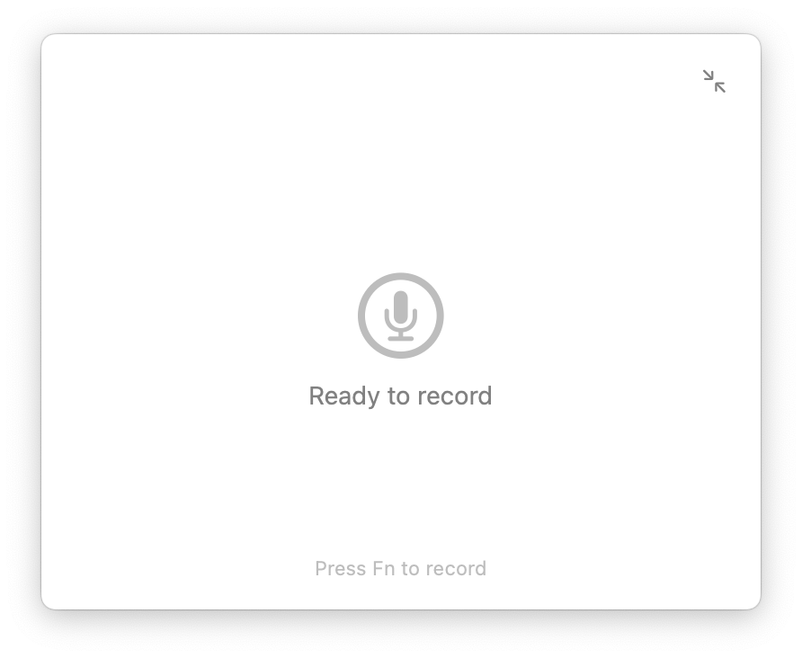

# WhisperMate

A native macOS voice-to-text app powered by Groq's Whisper API.



## Key Features

### Security & Privacy
- Open source - read the code to see exactly how data is handled
- Audio is transcribed and immediately discarded, nothing is stored
- Data only sent to Groq API, no third-party servers
- API keys stored in macOS Keychain

### Performance
- 400-800ms response times using Groq's inference
- Native Swift/SwiftUI implementation
- 1.35 MB app size (vs 200+ MB for Electron-based alternatives)
- Minimal CPU and memory usage

### LLM Post-Processing
- Optional transformations using Groq's LLM models
- Translate between languages (e.g. speak Russian, get English text)
- Adjust tone or formality
- Custom glossaries for domain-specific terms

### Usage
- Press and hold a hotkey (like Fn) to record
- Double-tap for continuous recording mode
- Auto-paste transcriptions into active application
- Minimal overlay indicator or full window mode

### Pricing
Free during beta. You only pay for Groq API usage.

## Installation

### Option 1: Download Release (Recommended)

1. Download the latest `WhisperMate-v0.0.4.dmg` from the [Releases page](https://github.com/writingmate/whispermate/releases/latest)
2. Open the DMG file
3. Drag Whispermate to your Applications folder
4. Launch Whispermate from Applications
5. Follow the onboarding wizard to:
   - Grant microphone permission
   - Grant accessibility permission (for auto-paste)
   - Configure your recording hotkey

### Option 2: Build from Source

#### Prerequisites

- macOS 13.0+ (Ventura or later)
- Xcode 15.0+
- Groq API key (get one at https://console.groq.com)

#### Steps

1. Clone the repository:
   ```bash
   git clone https://github.com/writingmate/whispermate.git
   cd whispermate/Whishpermate
   ```

2. Open the project:
   ```bash
   open Whispermate.xcodeproj
   ```

3. Build and run (⌘R)

4. Follow the onboarding wizard on first launch

## Getting Started

1. **First Launch**: Complete the onboarding wizard
   - Enable microphone access
   - Enable accessibility permissions (needed for auto-paste)
   - Set your recording hotkey (Fn key recommended)

2. **Recording**:
   - **Hold-to-Record**: Press and hold your hotkey, release to transcribe
   - **Continuous Recording**: Double-tap your hotkey to start, tap once to stop

3. **Modes**:
   - **Overlay Mode**: Minimal indicator in bottom-right corner
   - **Full Mode**: Expanded window with settings and transcription history

4. **Settings**:
   - Configure your Groq API key
   - Choose between OpenAI Whisper or Groq transcription
   - Customize hotkey
   - Toggle auto-paste functionality

## Security

- API keys are stored securely in macOS Keychain (never in plain text)
- Audio files are temporary and not persisted
- No data is sent anywhere except to Groq's API

## Architecture

```
WhisperMate/
├── WhisperMateApp.swift          # App entry point
├── Views/
│   └── ContentView.swift          # Main UI
├── Services/
│   ├── AudioRecorder.swift        # Audio recording with AVFoundation
│   ├── GroqAPIClient.swift        # Groq API integration
│   └── KeychainHelper.swift       # Secure key storage
└── Info.plist                     # App permissions
```

## Groq API

This app uses Groq's Whisper Large V3 model for transcription:
- Fast inference times (typically < 1 second)
- High accuracy
- Cost-effective

Get your API key: https://console.groq.com

## License

MIT
